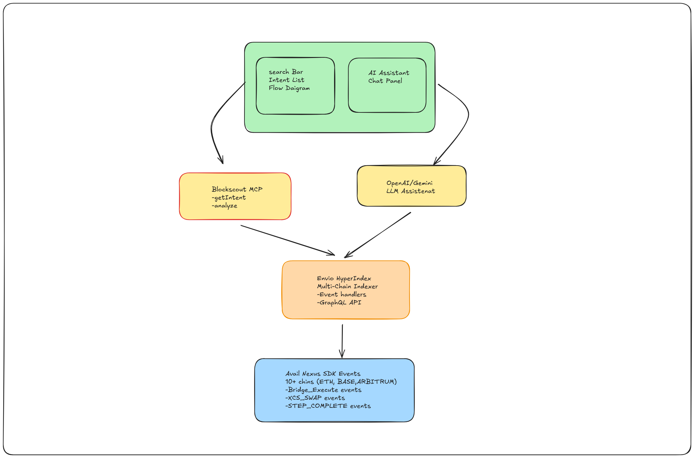

# 🔍 Cross-Chain Intent Explorer

> AI-powered infrastructure for debugging Avail Nexus SDK cross-chain intent lifecycles with real-time failure analysis and multi-chain monitoring.

---

## 🎯 The Problem

Cross-chain intent transactions are complex multi-step operations that can fail at any stage—bridging, executing, or swapping—across different blockchains. Currently, developers and users face:

- **Zero visibility** into intent lifecycle stages when transactions fail
- **No debugging tools** to understand why a Bridge & Execute or XCS Swap failed
- **Manual tracking** across multiple block explorers for different chains
- **No AI accessibility** for automated failure analysis and retry suggestions

The [ERC-7683 Cross-Chain Intents Standard](https://ethereum-magicians.org/t/erc-7683-cross-chain-intents-standard/19619) discussions highlight 45+ cross-chain vulnerabilities, yet no unified monitoring infrastructure exists.

---

## 💡 Our Solution

**Cross-Chain Intent Explorer** is the first infrastructure-level tool that:

✅ **Indexes intent events** from Avail Nexus SDK across 10+ EVM chains  
✅ **Tracks multi-step lifecycles** in real-time (lock → bridge → execute)  
✅ **Provides AI-powered debugging** via Blockscout MCP endpoints  
✅ **Visualizes failure points** with interactive flow diagrams  
✅ **Exposes developer APIs** for programmatic intent monitoring  

---

## 🏗️ Architecture

### Core Components

#### 1. **Envio HyperIndex** (Multi-Chain Data Layer)
- Monitors Avail Nexus SDK events across Ethereum, Optimism, Arbitrum, Base, Polygon, and more
- Captures intent lifecycle events:
  - `BRIDGE_EXECUTE_EXPECTED_STEPS`
  - `BRIDGE_EXECUTE_COMPLETED_STEPS`
  - `EXPECTED_STEPS`
  - `STEP_COMPLETE`
- Processes 5,000+ events/second with sub-second latency
- GraphQL API for querying intent history

#### 2. **Blockscout MCP Server** (AI-Accessible Layer)
- Custom plugin architecture for intent-specific queries
- MCP Tools:
  - `getIntentStatus(intentId)` - Fetch real-time intent state
  - `getIntentHistory(address)` - List all intents by wallet
  - `analyzeFailedIntent(intentId)` - AI-powered failure diagnosis
- Enables AI agents (Claude, Cursor, Gemini) to query blockchain data

#### 3. **Next.js Frontend** (Developer Interface)
- Search by wallet address, transaction hash, or intent ID
- Interactive Sankey diagrams showing fund flow across chains
- Timeline view of intent execution steps
- Embedded AI assistant for natural language queries
- Real-time notifications for intent status changes

#### 4. **AI Analysis Engine**
- Connects Blockscout MCP endpoints to LLM (OpenAI/Gemini)
- Pre-trained on Avail Nexus SDK event schemas
- Provides:
  - Root cause analysis for failures
  - Gas optimization suggestions
  - Retry recommendations with adjusted parameters

---

## 🎨 Key Features

### 🔎 **Intent Lifecycle Tracking**
Monitor every step of your cross-chain transactions:
Source Chain (Lock) → Bridge Transfer → Destination Chain (Execute)
✓ ✓ ❌ Failed

### 🤖 **AI-Powered Debugging**
Ask natural language questions:
- *"Why did my Ethereum → Arbitrum bridge fail at step 3?"*
- *"Show all failed intents from my wallet in the last 24 hours"*
- *"What gas price should I use to avoid this error?"*

### 📊 **Multi-Chain Dashboard**
Unified view across:
- Ethereum Mainnet
- Optimism
- Arbitrum
- Base
- Polygon
- Avalanche
- Scroll
- Linea
- Mantle
- Hyperliquid

### 🔗 **Developer API**

// Query intent status
const status = await explorer.getIntent("0x123...");

// Analyze failure
const analysis = await explorer.analyzeFailure("0x123...");
// Returns: { reason: "Slippage exceeded", suggestion: "Increase to 1.5%" }

---

## 🛠️ Tech Stack

| Layer | Technology | Purpose |
|-------|-----------|---------|
| **Indexing** | Envio HyperIndex | Multi-chain event capture & storage |
| **AI Layer** | Blockscout MCP | AI-accessible blockchain data endpoints |
| **SDK** | Avail Nexus Core | Cross-chain intent execution |
| **Frontend** | Next.js 14 | Server-side rendered React app |
| **UI Components** | Shadcn/ui, Tailwind | Modern, accessible design system |
| **Visualization** | React Flow, D3.js | Interactive intent flow diagrams |
| **AI Assistant** | OpenAI API / Gemini | Natural language query processing |
| **Database** | PostgreSQL | Indexed event storage (via Envio) |

---

Visit `http://localhost:3000` to see the explorer.

---

## 🎯 Use Cases

### For Developers
- **Debug failed cross-chain transactions** without manual chain hopping
- **Monitor intent performance** across different chains
- **Optimize gas strategies** with AI-powered suggestions
- **Integrate intent monitoring** into existing dApps via API

### For DeFi Protocols
- **Track user intent success rates** across chains
- **Identify systemic bridge failures** early
- **Provide users with self-service debugging** tools
- **Reduce support tickets** with AI-powered diagnostics

### For Users
- **Understand why transactions fail** in plain language
- **Get actionable retry suggestions** without technical knowledge
- **View complete transaction history** across all chains in one place

---

## 🔬 Why This Matters

### The Cross-Chain Intent Gap
According to research on blockchain interoperability security (SoK 2024), there are **45 documented cross-chain vulnerabilities** and **92 mitigation strategies**, yet developers lack real-time monitoring tools to implement these mitigations effectively.

### Market Validation
- **OneBalance** and **Circle's Unified API** prove demand for cross-chain aggregation
- **Range Explorer** shows users want unified views, but none support intent lifecycles
- **AI Agents in DeFi** article (TowardsAI, Jan 2025) identifies unified liquidity views as the missing link in DeFi's $100B liquidity challenge

### Technical Innovation
- **First intent-centric explorer** vs. existing token/transfer focus
- **Open-source infrastructure** vs. closed commercial APIs
- **AI-accessible endpoints** enabling the next generation of autonomous agents
- **Real-time multi-chain indexing** with sub-second latency

---

## 🏆 Hackathon Prizes Targeting

### Avail ($4,500)
**Track:** Build Unchained Apps with Avail Nexus SDK  
**Alignment:** Showcases Nexus SDK's Bridge & Execute and XCS Swaps features with comprehensive developer tooling that improves the entire ecosystem

### Envio ($1,500)
**Track:** Best use of HyperIndex  
**Alignment:** Novel multi-chain indexing pattern for intent lifecycle tracking across 10+ chains with custom event aggregation logic

### Blockscout ($3,500)
**Track:** Best use of MCP Server  
**Alignment:** First MCP server extension for cross-chain intent queries, enabling AI agents to access blockchain intent data

**Total Prize Potential:** $9,500

## 🗺️ Roadmap

### Phase 1: ETHGlobal Hackathon (Current)
- ✅ Core architecture design
- 🔄 Envio multi-chain indexer setup
- 🔄 Blockscout MCP plugin development
- 🔄 Basic Next.js UI with intent search
- 🔄 AI assistant integration

### Phase 2: Post-Hackathon
- Advanced flow visualizations (Sankey diagrams)
- Historical intent analytics dashboard
- Custom alert rules for intent failures
- Public API with rate limiting
- Mobile-responsive UI

### Phase 3: Production Ready
- Mainnet deployment across all 10+ chains
- WebSocket support for real-time updates
- Advanced AI models for predictive failure detection
- Integration with popular Web3 wallets
- Community-contributed MCP plugins

---

## 🤝 Contributing

We welcome contributions! See [CONTRIBUTING.md](./CONTRIBUTING.md) for guidelines.

Key areas for contribution:
- Additional chain support
- Custom MCP tools for specific intent patterns
- UI/UX improvements
- AI prompt engineering for better failure analysis
- Documentation and tutorials

---

## 📄 License

MIT License - see [LICENSE](./LICENSE) for details.

---

## 🙏 Acknowledgments

Built for ETHGlobal Online 2025 hackathon, powered by:
- [Avail Project](https://availproject.org) - Nexus SDK for cross-chain intents
- [Envio](https://envio.dev) - HyperIndex for multi-chain data indexing
- [Blockscout](https://blockscout.com) - MCP server for AI accessibility

Special thanks to the ERC-7683 working group for cross-chain intent standardization efforts.

---

## 📞 Contact & Links

- **GitHub:** [github.com/[your-username]/cross-chain-intent-explorer](https://github.com/Shubz224/-Cross-Chain-Intent-Explorer)
- **Demo:** [Coming soon]
- **Twitter:** [@your_handle]

---

  <strong>Building the future of cross-chain debugging, one intent at a time.</strong>

